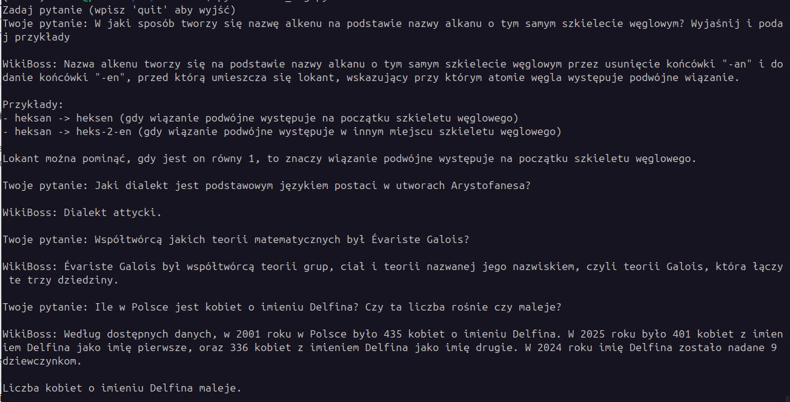

# wikiBoss
AI assistant operating on Polish Wikipedia.

## Prerequisites

*   **Docker** & **Make** (for running the vector database)
*   **Python 3.10+** (tested with 3.12)

## Getting started

1.  **Start Qdrant** \
    Run the following command to download the Docker image and start the container:
    ```bash
    make start
    ```
    *(Note: The `qdrant/qdrant` image will be pulled automatically if not present locally.)*

2.  **Create virtual environment, install dependencies**
    ```bash
    python -m venv .venv
    source .venv/bin/activate
    pip install -r requirements.txt
    python -m ipykernel install --user --name=wikiBoss
    ```

3.  **Run the data processing app**
    ```bash
    # check options
    python main_data.py --help
    
    # Examples
    ## Full pipeline with default 'on_tokens' chunking strategy
    python main.py

    ## Get all data and parse to jsonl file, test further processing on 100 articles with md_headers strategy
    python main_data.py --num-lines 100 --chunking-strategy on_md_headers --storage-suffix _test

    ## Only chunking step, all cleaned articles
    python main_data.py --no-download --no-clean --no-embedding

    ## Process cleaned articles from line 10000, add to existing chunk file and qdrant collection
    python main_data.py \
    --no-download --no-clean \
    --start-from 10000 \
    --clear-chunks False \
    --delete-collection False \
    --chunking-strategy on_tokens \
    --storage-suffix _model_name
    ```
    
4. Run the rag app
    ```bash
   # create .env file with Groq api key
   echo "GROQ_API_KEY=your_api_key" > .env
   
   # run in cli
   python main_rag.py
    ```
   Example:
